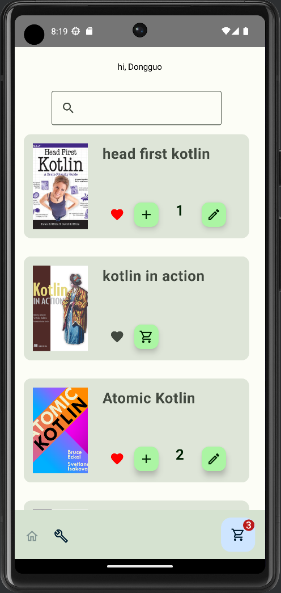
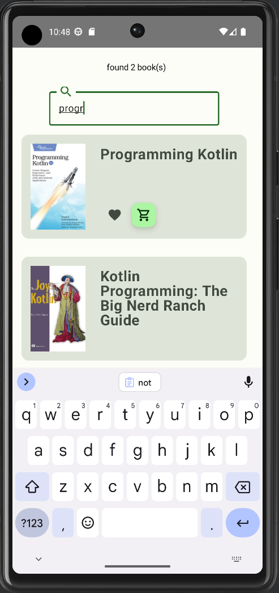
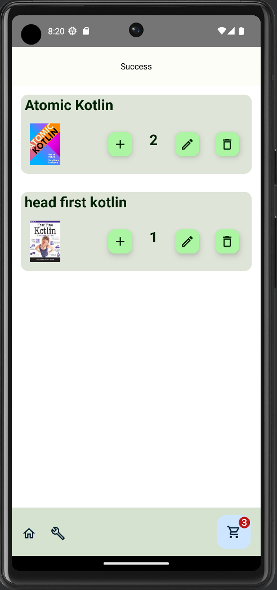
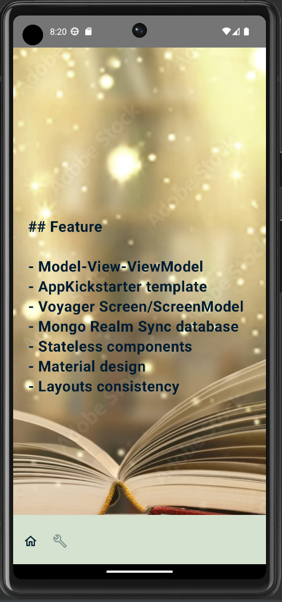
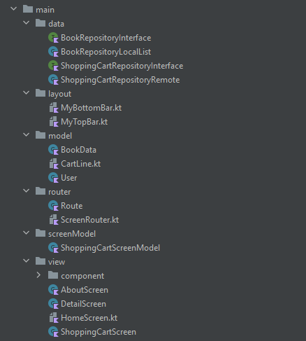

# Assignment #2: Multi-Screen CRUD Kotlin Multiplatform / Compose Multiplatform App

## [Dongguo Wu](https://github.com/dongguowu)

### Based on [AppKickstarter Template](https://github.com/JetBrains/compose-multiplatform-ios-android-template)

## Functionality

## Books Functionality Screen

**Read** operation

- display a list of book cards.
- search books by title

**Create, Update, Delete** operations

- add, update, remove item on shopping cart

 
  

## Shopping Cart Functionality Screen

**Read** operation

- display all items added to cart

**Update, Delete** operations

- increase, decrease the quantity of item
- remove item

## Book detail and app feature information screens

Implement CRUD

#### 4 (CRUD) may work for a single item at a time

- Create, add a book to shopping cart
- Read, get an shopping cart item by book id
- Update, update the quantity of item
- Delete, delete the item from shopping cart

#### 1 (R) must display a list (i.e., getAll)

- Display all items on Shopping cart screen

## Layout

- use Scaffold as the whole layout.
- share a common BottomAppBar to all four screens
- use BottomAppBar as navigator

## Project structure

## 

-- Model-View-ViewModel Pattern
